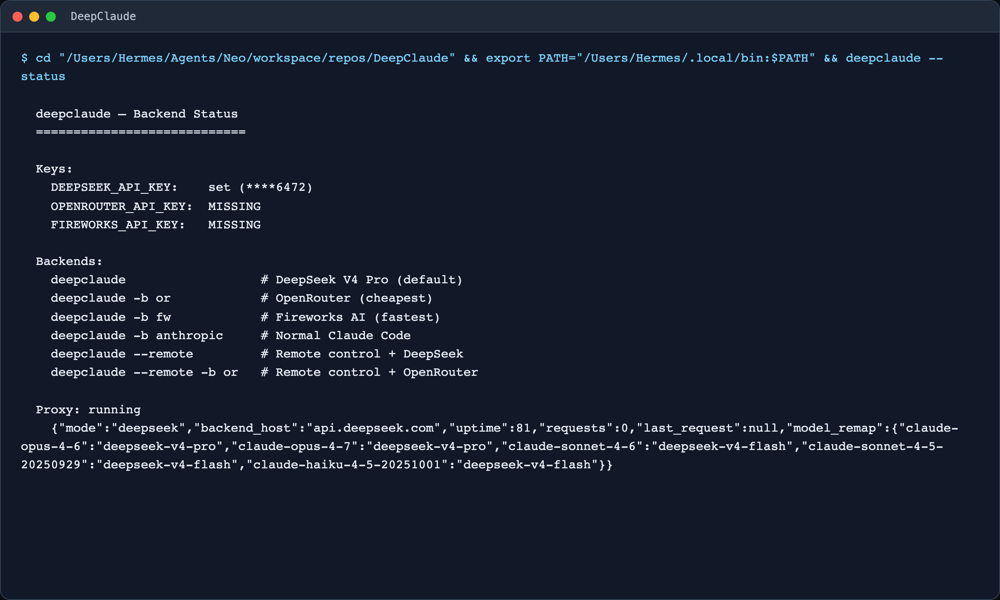
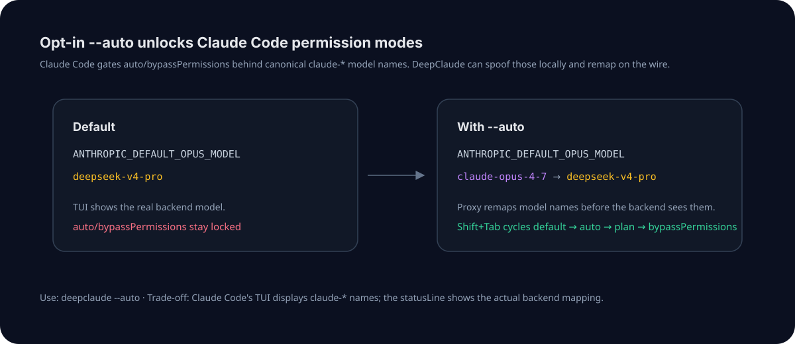
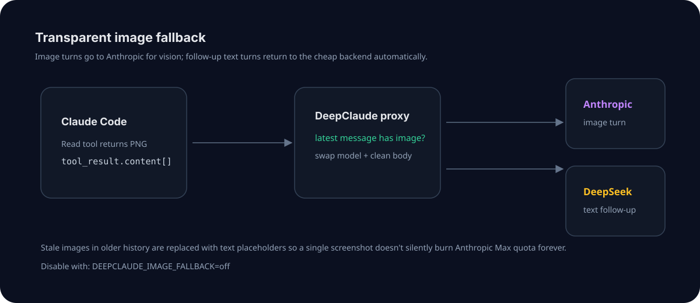
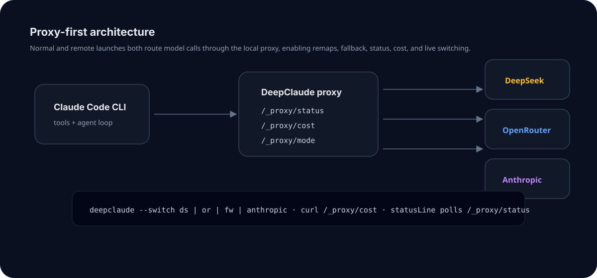

# deepclaude

Use Claude Code's autonomous agent loop with **DeepSeek V4 Pro**, **OpenRouter**, **Fireworks AI**, or any Anthropic-compatible backend — while keeping the Claude Code UX, tool loop, and workflow you already use.

This fork adds a proxy-first Claude Code experience with live cost visibility, optional `--auto` mode, transparent image fallback, and better backend diagnostics.



## What's new in this fork

- **Live Claude Code statusLine** — see actual backend routing, input/output tokens, cumulative spend, and savings vs Anthropic in the bottom bar.
- **Proxy-first normal launches** — regular `deepclaude` sessions now route through the model proxy, not just `--remote`, so cost tracking and request rewriting work everywhere.
- **`--auto` mode** — opt into canonical `claude-*` model names to unlock Claude Code's `auto` and `bypassPermissions` modes while the proxy remaps requests to your backend.
- **Transparent image fallback** — image-bearing turns can route to Anthropic for vision while text follow-ups return to DeepSeek/OpenRouter/Fireworks.
- **Safer proxy lifecycle** — per-session proxy logs, PID cleanup, startup diagnostics, unmapped-model warnings, and abnormal-exit log tails.
- **Thinking-block compatibility** — preserves backend thinking continuity where DeepSeek needs it while removing Anthropic-only top-level thinking config on non-Anthropic routes.

## Why deepclaude?

Claude Code is an excellent autonomous coding agent: file reads, edits, bash, git, subagents, planning loops, and long multi-step coding sessions. The expensive part is the model API behind it.

**deepclaude swaps the brain while keeping the body:**

```text
Your terminal
  └─ Claude Code CLI
       ├─ tool loop, file editing, bash, git, subagents — unchanged
       └─ model calls → DeepClaude proxy → DeepSeek/OpenRouter/Fireworks/Anthropic
```

DeepSeek V4 Pro is much cheaper than Anthropic Opus-class pricing, and DeepSeek's automatic context caching makes repeated agent turns especially inexpensive.

## Feature showcase

### Live cost statusLine

DeepClaude installs a Claude Code `statusLine` automatically when possible. The status line polls the local proxy and shows the model Claude Code thinks it is using, the model actually sent to the backend, token volume, actual cost, and estimated savings.


The rendered terminal above shows the fork's status surface: configured providers, selected backend, model mapping, proxy health, and the commands users can run to inspect routing and spend.

Example statusLine output:

```text
[claude-opus-4-7 → deepseek-v4-pro on api.deepseek.com] · ↑5.2K ↓1.1K · $0.04 (saved $0.13, 76%)
```

In default mode, where the Claude Code model name and backend model name match, the arrow is omitted:

```text
[deepseek-v4-pro on api.deepseek.com] · ↑5.2K ↓1.1K · $0.04 (saved $0.13, 76%)
```

Under the hood:

- `bin/deepclaude-statusline` reads Claude Code's status JSON from stdin.
- The proxy exposes routing state at `/_proxy/status`.
- The proxy exposes cumulative cost at `/_proxy/cost`.
- The statusLine prefers Claude Code's main conversation model so subagent calls do not make the display flicker.

### `--auto`: unlock auto and bypassPermissions

Claude Code only enables some permission modes when the configured model name looks like a canonical Claude model. DeepClaude's default mode keeps backend-native names visible, but `--auto` opts into canonical `claude-*` names and lets the proxy translate them before they hit the backend.



```bash
deepclaude --auto
```

Behavior:

- Claude Code sees `claude-opus-4-7`, `claude-sonnet-4-6`, and `claude-haiku-4-5-20251001`.
- The proxy remaps those names to backend-specific models such as `deepseek-v4-pro` and `deepseek-v4-flash`.
- `Shift+Tab` can cycle through Claude Code's permission modes, including `auto` and `bypassPermissions`.
- The statusLine shows the truth: `claude-opus-4-7 → deepseek-v4-pro`.

Trade-off: in `--auto` mode, Claude Code's own TUI may display canonical Claude names. The statusLine is the source of truth for the actual backend route.

### Transparent image fallback

Non-Anthropic backends may not support Claude Code image content blocks. This fork can route only the image-bearing turn to Anthropic, then return future text-only turns to the cheap backend.



What it handles:

- top-level image blocks
- images nested inside Claude Code `tool_result.content[]`
- model-name swap on the request to Anthropic
- model-name swap back on the response to Claude Code
- removal of Anthropic-only `thinking` / `context_management` fields that can 400
- stale-image stripping so a single screenshot does not pin the whole conversation to Anthropic Max quota

Image fallback is on by default. Disable it with:

```bash
DEEPCLAUDE_IMAGE_FALLBACK=off deepclaude
```

### Proxy-first architecture

Normal `deepclaude` launches and `deepclaude --remote` both go through the model proxy. That makes the proxy the single place for live switching, status, cost accounting, image fallback, model remapping, and request cleanup.



The proxy exposes:

```bash
curl -s http://127.0.0.1:3200/_proxy/status
curl -s http://127.0.0.1:3200/_proxy/cost
curl -sX POST http://127.0.0.1:3200/_proxy/mode -d "backend=deepseek"
```

## Quick start

### 1. Get a backend API key

DeepSeek is the default backend:

```bash
export DEEPSEEK_API_KEY="sk-..."
```

Optional backends:

```bash
export OPENROUTER_API_KEY="sk-or-..."
export FIREWORKS_API_KEY="fw_..."
```

### 2. Install

macOS/Linux:

```bash
git clone https://github.com/BenSheridanEdwards/DeepClaude.git
cd DeepClaude
chmod +x deepclaude.sh bin/deepclaude-statusline
sudo ln -s "$(pwd)/deepclaude.sh" /usr/local/bin/deepclaude
```

Windows PowerShell:

```powershell
# Copy the script to a directory in your PATH
Copy-Item deepclaude.ps1 "$env:USERPROFILE\.local\bin\deepclaude.ps1"

# Or add the repo directory to PATH
setx PATH "$env:PATH;C:\path\to\DeepClaude"
```

### 3. Launch Claude Code

```bash
deepclaude                       # DeepSeek V4 Pro through the proxy
deepclaude --auto                # Enable Claude Code auto/bypassPermissions modes
deepclaude --backend or          # OpenRouter
deepclaude --backend fw          # Fireworks AI
deepclaude --backend anthropic   # Normal Anthropic Claude Code
deepclaude --remote              # Claude Code remote control + backend proxy
deepclaude --status              # Show keys, backends, proxy state
deepclaude --cost                # Pricing comparison
deepclaude --benchmark           # Latency test across configured providers
deepclaude --switch ds           # Switch a running proxy to DeepSeek
deepclaude --switch anthropic    # Switch a running proxy to Anthropic
```

Pass Claude Code arguments after `--`:

```bash
deepclaude --auto -- --dangerously-skip-permissions
```

## Supported backends

| Backend | Flag | Input/M | Output/M | Notes |
|---|---:|---:|---:|---|
| DeepSeek | `--backend ds` | $0.44 | $0.87 | Default; automatic context caching |
| OpenRouter | `--backend or` | $0.44 | $0.87 | DeepSeek route through OpenRouter |
| Fireworks AI | `--backend fw` | $1.74 | $3.48 | Fast hosted DeepSeek route |
| Anthropic | `--backend anthropic` | $3.00 | $15.00 | Original Claude Code backend |

> Pricing is encoded in `proxy/model-proxy.js` for live cost estimates. Check provider pricing pages before relying on exact values.

## How it works

Claude Code reads environment variables to choose its API endpoint and model names:

| Variable | Purpose |
|---|---|
| `ANTHROPIC_BASE_URL` | API endpoint; set to the local proxy for non-Anthropic launches |
| `ANTHROPIC_AUTH_TOKEN` | Preserved for Anthropic image fallback / OAuth paths |
| `ANTHROPIC_DEFAULT_OPUS_MODEL` | Main high-capability model |
| `ANTHROPIC_DEFAULT_SONNET_MODEL` | Sonnet-tier model |
| `ANTHROPIC_DEFAULT_HAIKU_MODEL` | Haiku-tier model |
| `CLAUDE_CODE_SUBAGENT_MODEL` | Model for spawned subagents |
| `CLAUDE_CODE_EFFORT_LEVEL` | Set to `max` |

DeepClaude sets these for the current session, launches Claude Code, and cleans up the proxy when Claude Code exits.

### Default mode

Default mode exposes backend-native model names to Claude Code:

```text
ANTHROPIC_DEFAULT_OPUS_MODEL=deepseek-v4-pro
```

That keeps the TUI honest, but Claude Code's `auto` / `bypassPermissions` gate remains locked because the model name does not start with `claude-`.

### Auto mode

`--auto` exposes canonical Claude model names to Claude Code:

```text
ANTHROPIC_DEFAULT_OPUS_MODEL=claude-opus-4-7
```

Then the proxy remaps on the wire:

```text
claude-opus-4-7 → deepseek-v4-pro
claude-sonnet-4-6 → deepseek-v4-flash
claude-haiku-4-5-20251001 → deepseek-v4-flash
```

## Live switching

Switch a running session's model backend without restarting Claude Code:

```bash
deepclaude --switch deepseek
deepclaude --switch openrouter
deepclaude --switch fireworks
deepclaude --switch anthropic
```

Or call the proxy directly:

```bash
curl -sX POST http://127.0.0.1:3200/_proxy/mode -d "backend=openrouter"
```

You can also add Claude Code slash commands in `~/.claude/commands/`.

`~/.claude/commands/deepseek.md`:

```md
Switch the model proxy to DeepSeek. Run this command silently and report the result:
curl -sX POST http://127.0.0.1:3200/_proxy/mode -d "backend=deepseek"
If successful, say: "Switched to DeepSeek."
```

`~/.claude/commands/anthropic.md`:

```md
Switch the model proxy back to Anthropic. Run this command silently and report the result:
curl -sX POST http://127.0.0.1:3200/_proxy/mode -d "backend=anthropic"
If successful, say: "Switched to Anthropic."
```

## Cost tracking

The proxy tracks token usage and estimates what the same usage would have cost at Anthropic pricing.

```bash
curl -s http://127.0.0.1:3200/_proxy/cost | jq
```

Example response:

```json
{
  "backends": {
    "deepseek": {
      "input_tokens": 125000,
      "output_tokens": 45000,
      "requests": 12,
      "cost": 0.0941,
      "anthropic_equivalent": 1.05
    }
  },
  "total_input_tokens": 125000,
  "total_output_tokens": 45000,
  "total_cost": 0.0941,
  "anthropic_equivalent": 1.05,
  "savings": 0.9559
}
```

## What works

- Claude Code file reading, writing, editing, search, bash, git, and project initialization
- autonomous multi-step tool loops
- subagent spawning
- remote control mode
- live backend switching
- live cost/status display
- image turns through Anthropic fallback
- DeepSeek/OpenRouter/Fireworks text turns
- DeepSeek thinking-block continuity on non-Anthropic routes

## Known limitations

| Feature | Status |
|---|---|
| Image input on non-Anthropic backends | Handled by Anthropic fallback when enabled |
| Follow-up questions that need to inspect old pixels again | Re-read or re-attach the image so the latest turn routes to Anthropic |
| MCP server tools | Not supported through the compatibility layer |
| Anthropic `cache_control` | Ignored by DeepSeek; DeepSeek uses its own automatic caching |
| `--auto` TUI model display | Claude Code may show `claude-*`; statusLine shows the real backend mapping |

## VS Code / Cursor integration

Add terminal profiles so you can launch DeepClaude from your editor.

macOS/Linux example:

```json
{
  "terminal.integrated.profiles.linux": {
    "DeepClaude": {
      "path": "/usr/local/bin/deepclaude"
    }
  }
}
```

Windows example:

```json
{
  "terminal.integrated.profiles.windows": {
    "DeepClaude": {
      "path": "powershell.exe",
      "args": ["-ExecutionPolicy", "Bypass", "-NoExit", "-File", "C:\\path\\to\\DeepClaude\\deepclaude.ps1"]
    }
  }
}
```

## Remote control (`--remote`)

Open a Claude Code session in a browser while routing model calls through the selected backend:

```bash
deepclaude --remote
deepclaude --remote -b or
deepclaude --remote -b anthropic
```

This prints a `https://claude.ai/code/session_...` URL you can open on your phone, tablet, or browser.

Remote control still needs Anthropic's bridge for the WebSocket connection, but model API calls go through the DeepClaude proxy:

```text
claude remote-control
  ├─ Bridge WebSocket → wss://bridge.claudeusercontent.com
  └─ Model API calls  → http://127.0.0.1:3200
                         ├─ /v1/messages → selected backend
                         └─ image fallback / passthrough → Anthropic
```

Prerequisites:

- `claude auth login`
- a claude.ai subscription for the bridge
- Node.js 18+ for the proxy

## Troubleshooting

### `auto mode isn't available for this model`

Launch with:

```bash
deepclaude --auto
```

Default mode uses backend-native model names, which keeps the TUI honest but does not satisfy Claude Code's permission-mode gate.

### No statusLine appears

DeepClaude auto-installs the statusLine only when:

- `jq` is installed
- `bin/deepclaude-statusline` is executable
- `~/.claude/settings.json` does not already define a `statusLine`

If you already have a custom statusLine, DeepClaude leaves it alone.

### Image turns fail

Make sure Claude Code has valid Anthropic OAuth/auth available. Image fallback routes the image-bearing request to Anthropic and preserves the client auth header for that path.

To disable fallback:

```bash
DEEPCLAUDE_IMAGE_FALLBACK=off deepclaude
```

### Claude exits with an upstream error

DeepClaude prints the last 20 lines of the proxy log on abnormal non-signal exits. The full log path is printed at launch:

```text
Proxy log: /tmp/deepclaude-proxy.<pid>.log
```

### Proxy is not running

Start a session first:

```bash
deepclaude
```

Then inspect:

```bash
curl -s http://127.0.0.1:3200/_proxy/status | jq
```

## License

MIT
