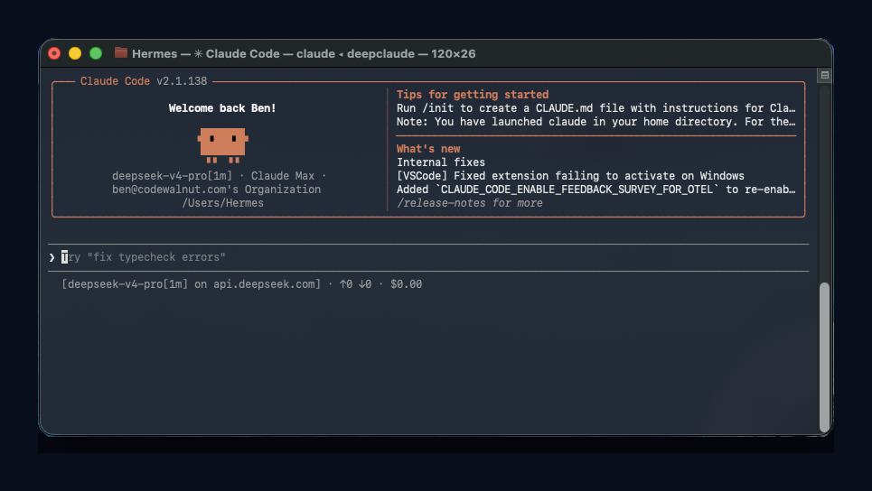
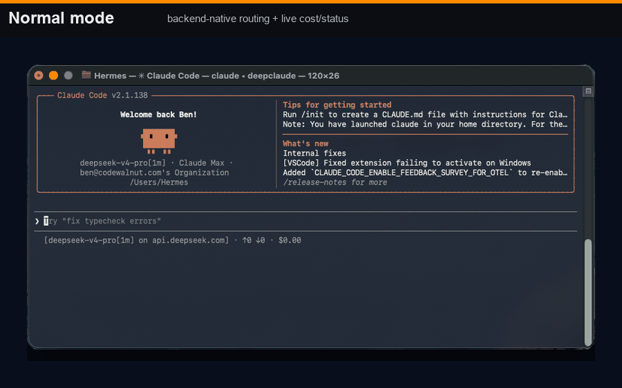
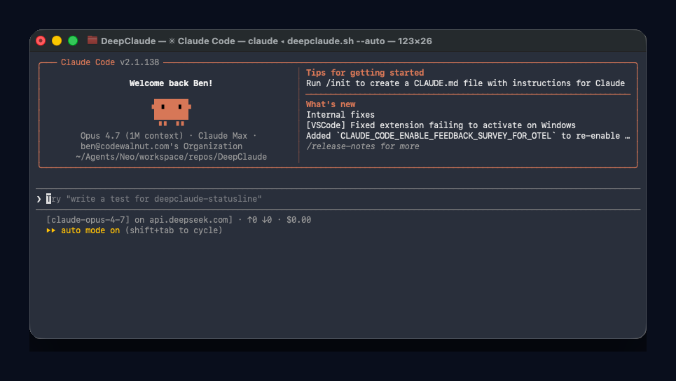

# DeepClaude

<div align="center">

**Claude Code frontend. DeepSeek backend. Live route + cost visibility.**

[](https://docs.anthropic.com/en/docs/claude-code)
[](#backend-selection)
[](#auto-mode)
[](#license)

Use the Claude Code workflow you already like, but route the model calls through cheaper Anthropic-compatible backends — without losing sight of which model actually answered or what the session is costing.

</div>

<p align="center">
  
</p>

## The pitch

Claude Code is a great coding-agent interface: repo awareness, file edits, bash, git, planning, permissions, subagents, and an interactive terminal loop that feels good in real work.

DeepClaude keeps that interface and changes the transport:

```text
Claude Code UI  →  local DeepClaude proxy  →  DeepSeek / OpenRouter / Fireworks / Anthropic
```

No forked UI. No fake screenshots. No hidden routing. The bottom statusLine tells you the backend, token volume, spend, and estimated savings while you work.

## At a glance

| You get | Why it matters |
|---|---|
| **Claude Code as the frontend** | Keep the agentic coding loop, permissions, IDE context, `/model`, and familiar TUI. |
| **Lower-cost backend routing** | Default to DeepSeek; switch to OpenRouter, Fireworks, or Anthropic when needed. |
| **Truthful statusLine** | Claude Code compatibility labels can be confusing; DeepClaude shows the real backend route and cost. |
| **`--auto` support** | Unlock Claude Code auto/bypass workflows while the proxy maps canonical Claude names to your backend. |
| **Vision fallback** | Route image-bearing turns to a vision-capable backend, then return text-only turns to the primary backend. |
| **Live diagnostics** | Inspect status, cost, proxy route, and switch backends without restarting the whole workflow. |

## What this fork adds

This fork turns DeepClaude from a clever proxy into something closer to a daily driver:

- **Proxy-first launch:** `deepclaude` starts and supervises the local proxy before Claude Code opens.
- **Live, truthful `statusLine`:** shows `Claude model → backend model on backend host`, token counts, cumulative spend, and estimated savings.
- **`--auto` mode:** maps Claude Code’s canonical auto/bypass model names onto the selected backend, so auto workflows work without pretending requests went somewhere else.
- **Image fallback:** routes only image-bearing requests to a vision-capable backend instead of failing the whole session.
- **Thinking-block continuity:** preserves Claude Code’s expected thinking/tool-call structure across proxy rewrites.
- **Diagnostics:** status, cost, remote-control, and backend-switch commands for debugging a running session.

## Demo: normal vs auto

<p align="center">
  
</p>

The GIF uses the same real terminal captures as the screenshots below: normal mode shows backend-native routing, while `--auto` keeps Claude Code's autonomy flow enabled and lets DeepClaude remap the backend behind the scenes.

### Normal mode: maximum routing transparency

```bash
deepclaude
```

Use this when you want the UI and the backend path to be as explicit as possible. The DeepClaude statusLine is the route-of-record:

```text
[claude-opus-4-7 → deepseek-v4-pro on api.deepseek.com] · ↑5.2K ↓1.1K · $0.04 (saved $0.13)
```

### Auto mode: Claude Code autonomy, backend remapping

```bash
deepclaude --auto
```

<p align="center">
  
</p>

Auto mode enables Claude Code’s faster autonomous loop, including bypassPermissions-style workflows. Claude Code may display canonical Claude model names because its auto/permission gates are tied to those labels; DeepClaude still shows the actual backend route in the statusLine.

## Quick start

### 1. Clone

```bash
git clone https://github.com/BenSheridanEdwards/DeepClaude.git
cd DeepClaude
```

### 2. Add an API key

Create `.env` in the repo root. Use whichever backend you want:

```bash
# DeepSeek is the default backend
DEEPSEEK_API_KEY=<your-deepseek-key>

# Optional alternatives
OPENROUTER_API_KEY=<your-openrouter-key>
FIREWORKS_API_KEY=<your-fireworks-key>

# Optional default backend: ds | or | fw | anthropic
CHEAPCLAUDE_DEFAULT_BACKEND=ds

# Optional image fallback backend: openrouter | anthropic | off
DEEPCLAUDE_IMAGE_FALLBACK=openrouter
```

You can also export these variables in your shell instead of using `.env`.

### 3. Install the launcher

```bash
chmod +x deepclaude.sh
ln -sf "$PWD/deepclaude.sh" /usr/local/bin/deepclaude
```

Or run it directly:

```bash
./deepclaude.sh
```

### 4. Launch Claude Code through DeepClaude

```bash
deepclaude
```

That starts the local proxy, configures Claude Code to talk to it, installs the DeepClaude statusLine, and opens Claude Code.

## Backend selection

Pick a backend at launch:

```bash
deepclaude --backend ds          # DeepSeek
deepclaude --backend or          # OpenRouter
deepclaude --backend fw          # Fireworks
deepclaude --backend anthropic   # Anthropic passthrough
```

Or set a default:

```bash
CHEAPCLAUDE_DEFAULT_BACKEND=or deepclaude
```

Supported backend aliases:

| Alias | Backend | Use it when |
|---|---|---|
| `ds` | DeepSeek | You want the default low-cost coding route. |
| `or` | OpenRouter | You want provider flexibility or a vision fallback path. |
| `fw` | Fireworks | You want Fireworks-hosted model routing. |
| `anthropic` | Anthropic passthrough | You want to compare against the native Claude path. |

## Mode matrix

| Mode | Command | Claude Code UI may show | DeepClaude statusLine shows | Best for |
|---|---|---|---|---|
| Normal | `deepclaude` | Backend-native model labels | Actual backend route, tokens, cost | Transparent day-to-day coding |
| Auto | `deepclaude --auto` | Canonical Claude labels | Canonical label → backend model | Auto/bypass workflows |
| Vision fallback | `DEEPCLAUDE_IMAGE_FALLBACK=openrouter deepclaude` | Normal session UI | Image turns routed to fallback | Screenshot/image questions without pinning the whole session to vision |

## How it works

```text
Claude Code
   │
   │ Anthropic Messages API requests
   ▼
DeepClaude local proxy (127.0.0.1:3200)
   │
   ├─ rewrites model names when needed
   ├─ preserves Claude Code tool/thinking structure
   ├─ detects image-bearing turns for fallback routing
   ├─ tracks tokens, costs, and estimated savings
   ├─ exposes /_proxy/status and /_proxy/cost
   │
   ▼
DeepSeek / OpenRouter / Fireworks / Anthropic
```

DeepClaude does not replace Claude Code. It sits between Claude Code and the model provider, translating just enough for Claude Code’s UX to keep working while the backend changes.

### What stays the same

- Claude Code’s terminal interface
- repo and IDE context
- file reads/writes and bash tools
- permission modes and agent loop
- your normal Claude Code workflow

### What DeepClaude changes

- the upstream model provider
- model-name mapping when Claude Code needs canonical names
- image-turn fallback routing
- status/cost visibility
- backend switching and local diagnostics

## Live switching and diagnostics

Check the running proxy:

```bash
deepclaude --status
deepclaude --cost
```

Switch backend while the proxy is running:

```bash
deepclaude --switch ds
deepclaude --switch or
deepclaude --switch fw
deepclaude --switch anthropic
```

Remote-control endpoint:

```bash
deepclaude --remote
```

The proxy also exposes local diagnostic endpoints:

```bash
curl http://127.0.0.1:3200/_proxy/status
curl http://127.0.0.1:3200/_proxy/cost
```

## Image fallback

Some backends are excellent for text and code but do not accept image content blocks. DeepClaude can detect image-bearing requests and route those specific turns to a vision-capable fallback.

```bash
DEEPCLAUDE_IMAGE_FALLBACK=openrouter deepclaude
```

Behavior:

- If a turn contains an image, DeepClaude routes that turn to the configured vision fallback.
- If the next turn is text-only, it returns to the primary backend.
- If you want follow-up vision reasoning, attach the image again or keep using a vision-capable primary backend.

This keeps normal coding turns cheap while avoiding hard failures when you paste screenshots into Claude Code.

## Cost tracking

DeepClaude tracks cumulative input tokens, output tokens, estimated backend cost, Anthropic-equivalent cost, and estimated savings.

Use:

```bash
deepclaude --cost
```

Or just watch the Claude Code statusLine while you work.

The goal is not fake precision; providers can change pricing and rounding. The goal is operational visibility: you should know which backend handled your request and roughly what the session is costing.

## Trust notes

DeepClaude is intentionally explicit about the places where proxying can be confusing:

- **Claude Code model names are compatibility labels.** In auto mode, Claude Code may show canonical Claude names because its permission/autonomy features are tied to those labels.
- **The DeepClaude statusLine is the route-of-record.** It shows the backend model and host that actually handled the request.
- **Image fallback is turn-scoped.** It does not permanently switch the whole session unless you choose a vision-capable backend yourself.
- **The proxy is local.** Claude Code talks to `127.0.0.1`; the proxy then talks to your selected backend.
- **Secrets stay in your environment.** Put API keys in `.env` or exported shell variables. Do not commit them.

## VS Code / Cursor integration

Claude Code’s IDE integrations continue to work because DeepClaude launches Claude Code itself. Start DeepClaude from the repo you want Claude Code to inspect:

```bash
cd /path/to/your/project
deepclaude
```

Claude Code still sees the working directory, files, terminal, and IDE context. DeepClaude only changes the model transport path.

## Troubleshooting

### `auto mode isn't available for this model`

Use:

```bash
deepclaude --auto
```

Auto mode maps Claude Code’s canonical auto/bypass model labels to the configured backend. Without `--auto`, Claude Code may reject auto workflows for non-canonical model names.

### No statusLine appears

Install `jq`, then relaunch:

```bash
brew install jq
# or: sudo apt-get install jq

deepclaude
```

DeepClaude installs the statusLine on launch, but Claude Code needs to reload its settings for changes to appear.

### The statusLine says the proxy is unreachable

Make sure DeepClaude launched Claude Code, rather than opening Claude Code directly:

```bash
deepclaude --status
deepclaude
```

If another process is using the proxy port, set a different one:

```bash
DEEPCLAUDE_PROXY_PORT=3202 deepclaude
```

### Image turns fail

Configure a vision-capable fallback:

```bash
DEEPCLAUDE_IMAGE_FALLBACK=openrouter
OPENROUTER_API_KEY=<your-openrouter-key>
deepclaude
```

If your primary backend already supports images, you can disable fallback:

```bash
DEEPCLAUDE_IMAGE_FALLBACK=off deepclaude
```

### Claude exits with an upstream error

Check the proxy status and backend key:

```bash
deepclaude --status
curl http://127.0.0.1:3200/_proxy/status
```

Common causes:

- missing or invalid API key
- backend outage or rate limit
- unsupported model mapping for the chosen backend
- corporate/VPN networking blocking the backend endpoint

## Contributing

This fork is biased toward practical Claude Code compatibility: fewer surprises, truthful status, and clean fallbacks. PRs that improve routing correctness, cost visibility, diagnostics, or provider support are welcome.

## License

MIT
